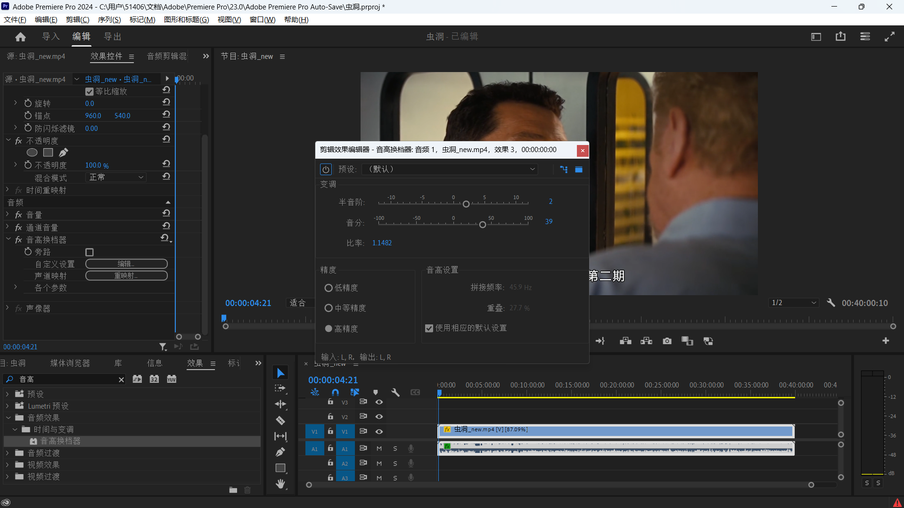

### 调整视频速度不变调

1. 设置「**速度/持续时间**」
2. 向音轨添加 **效果** 「**音高换挡器**」 和 「**用左侧填充右侧**」
3. **效果控件**→**音高换挡器**→**编辑**→**预设**：**默认**→修改**比率**为「**100/视频倍数**」



---

### 不受支持的视频压缩类型av01

```cmd
ffmpeg -i x.mp4 y.mp4
```

* x与y不能相同

### 多机位剪辑

1. **导入**若干多机位素材
2. 全选，右键「**创建多机位源序列**」
3. 右键第一个素材「**从剪辑新建序列**」
4. 点击🔧，选择「**多机位**」
